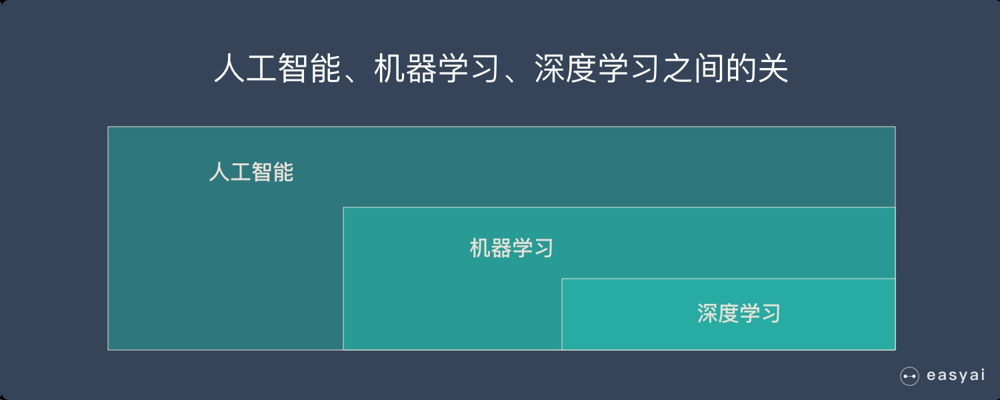
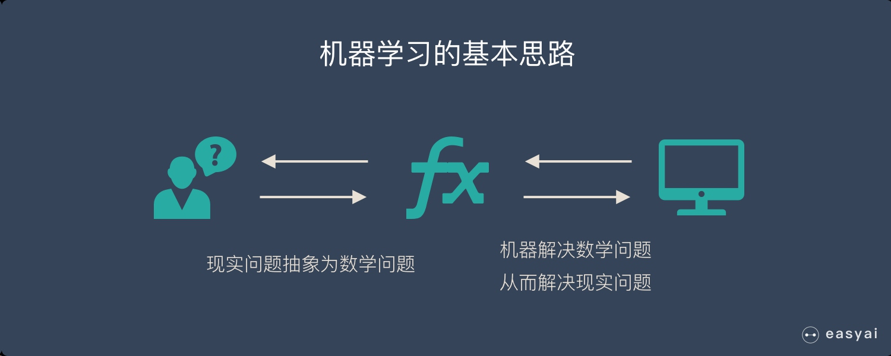

### 机器学习、人工智能、深度学习是什么关系？
1956 年提出 AI 概念，短短3年后（1959） Arthur Samuel 就提出了机器学习的概念：
>Field of study that gives computers the ability to learn without being explicitly programmed.机器学习研究和构建的是一种特殊算法（而非某一个特定的算法），能够让计算机自己在数据中学习从而进行预测。

所以，机器学习不是某种具体的算法，而是很多算法的统称。

机器学习包含了很多种不同的算法，深度学习就是其中之一，其他方法包括决策树，聚类，贝叶斯等。

深度学习的灵感来自大脑的结构和功能，即许多神经元的互连。人工神经网络（ANN）是模拟大脑生物结构的算法。

不管是机器学习还是深度学习，都属于人工智能（AI）的范畴。所以人工智能、机器学习、深度学习可以用下面的图来表示：

#### 什么是机器学习？
在解释机器学习的原理之前，先把最精髓的基本思路介绍给大家，理解了机器学习最本质的东西，就能更好的利用机器学习，同时这个解决问题的思维还可以用到工作和生活中。

机器学习的基本思路
1.把现实生活中的问题抽象成数学模型，并且很清楚模型中不同参数的作用
2.利用数学方法对这个数学模型进行求解，从而解决现实生活中的问题
3.评估这个数学模型，是否真正的解决了现实生活中的问题，解决的如何？

无论使用什么算法，使用什么样的数据，最根本的思路都逃不出上面的3步！

