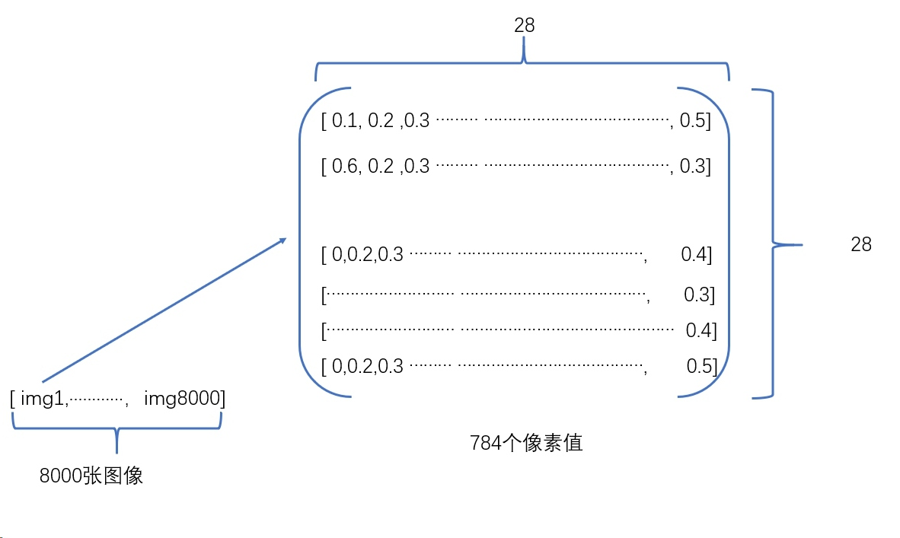

## 收集Fashion-MNIST数据集
### 1.导入库
 首先我们先导入TensorFlow和tf.keras,在后续的代码中,我们都将使用tf.keras,再导入工具包` numpy `用于数据处理 `matplotlib`用于数据可视化
```
## 加载TensorFlow相关的包
import tensorflow as tf
from tensorflow import keras
## 加载其他工具包
import numpy as np
import matplotlib.pyplot as plt
```
### 2.加载数据集
在tf.keras中已经集成了下载与加载Fashion-MNIST数据集的骨架程序,只需要导入与加载数据即可,数据集中的60000图片用于训练网络,10000张图片用于评估经过学习的网络分类图像的准确率

> 注:在机器学习中,我们一般会将数据集按照8:2的比例分为训练数据集和测试数据集,训练数据集用于训练模型,测试数据集用于测试训练好的模型的准确率.

```
fashion_mnist = keras.datasets.fashion_mnist

(train_images, train_labels), (test_images, test_labels) = fashion_mnist.load_data()
```
加载完数据集后会返回4个 `Numpy` 数组
* `train_images` 和 `train_labels` 数组是训练集，即模型用于学习的数据,共有60000张
* 测试集 `test_images` 和 `test_labels` 数组用于测试模型。共有10000张
`train_images` 和 `test_images` 中都为 **28x28** 的 NumPy 数组，每个点的值都是介于 0 到 255 之间。代表了当前这张图片 test_images 和test_labels是一个**10维的整数数组**,每个维度的值都是介于0到9之间。代表了当前图像的标签,这些标签对应于图像代表的服饰所属的类别：
### 3.初探数据集
当我们加载好数据集后,下面就让我们探索一下加载成功后的数据集的格式与数量等.


我们先探索数据集的格式,然后再训练模型。我们先查看一下数据集中的图片的形状
```
print(train_images.shape)
```
我们再查看一下 数据集中标签的形状
```
print(train_labels.shape)
```