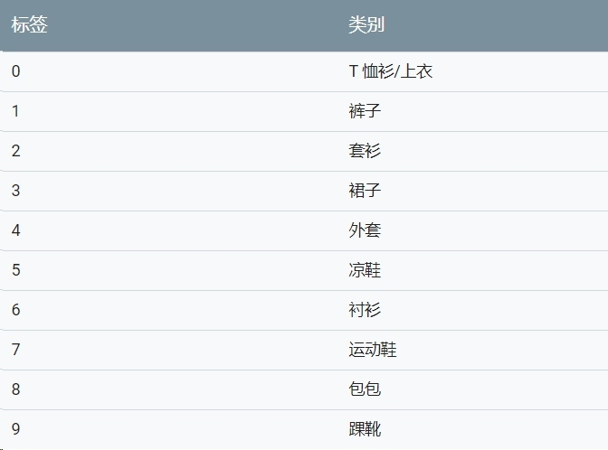

## 数据预处理
我们将探索一下数据集并对数据集进行预处理
### 1.查看数据集中的图片
```
print(train_images[0])
```
是不是很难看懂，没关系，我们来可视化一下图片
```
## 创建新的图像
plt.figure()
## 显示图像 (填入图像)
plt.imshow(train_images[0])
## 给子图添加colorbar（颜色条或渐变色条）
plt.colorbar()
## 设置网格线
plt.grid(False)
```

### 2.查看数据集中的标签
`test_images` 和 `test_labels`是一个10维的整数数组,每个维度的值都是介于0到9之间。代表了当前图像的标签,这些标签对应于图像代表的服饰所属的类别：


每张图像都映射到一个标签。由于数据集中不包含类别名称，因此将它们存储在此处，以便稍后在绘制图像表时使用：
```
class_names = ['T-shirt/top', 'Trouser', 'Pullover', 'Dress', 'Coat',
               'Sandal', 'Shirt', 'Sneaker', 'Bag', 'Ankle boot']
```
```
print(train_labels[0])
print(class_names[train_labels[0]])
```
### 练习.显示第三张图片及其标签
```
##code

```
### 3.数据预处理
我们将图片中的这些值缩小到 0 到 1 之间，然后将其馈送到神经网络模型。为此，将图像组件的数据类型从整数转换为浮点数，然后除以 255。这样更容易训练,以下是预处理图像的函数：务必要以相同的方式对训练集和测试集进行预处理：
```
train_images = train_images / 255.0

test_images = test_images / 255.0
```
显示预处理完后的 第一张图像
```
plt.figure()
plt.imshow(train_images[0])
plt.colorbar()
plt.grid(False)
```
### 4.显示处理完后的数据集
显示训练集中的前 25 张图像，并在每张图像下显示类别名称。验证确保数据格式正确无误，然后我们就可以开始构建和训练网络了。
```
plt.figure(figsize=(10,10))
for i in range(25):
    ## 在当前图下生成子图 5*5个图
    plt.subplot(5,5,i+1)
    plt.xticks([])
    plt.yticks([])
    plt.grid(False)
    plt.imshow(train_images[i], cmap=plt.cm.binary)
    // 显示 当前图片的类别
    plt.xlabel(class_names[train_labels[i]])
```


