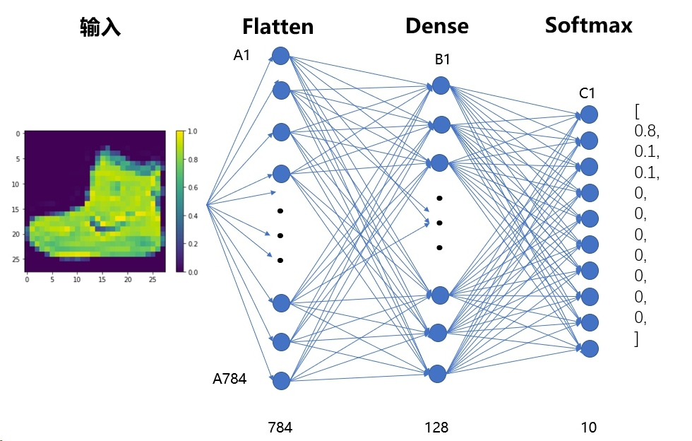
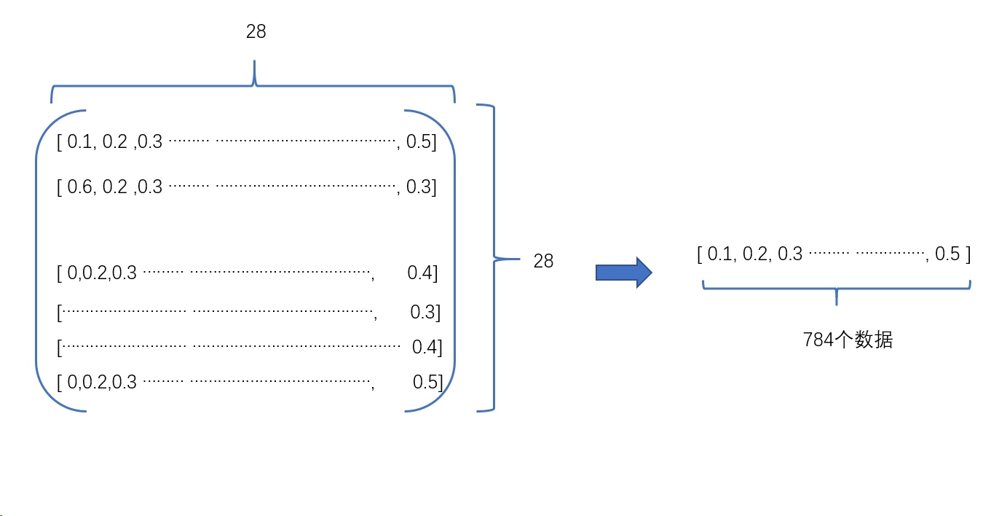
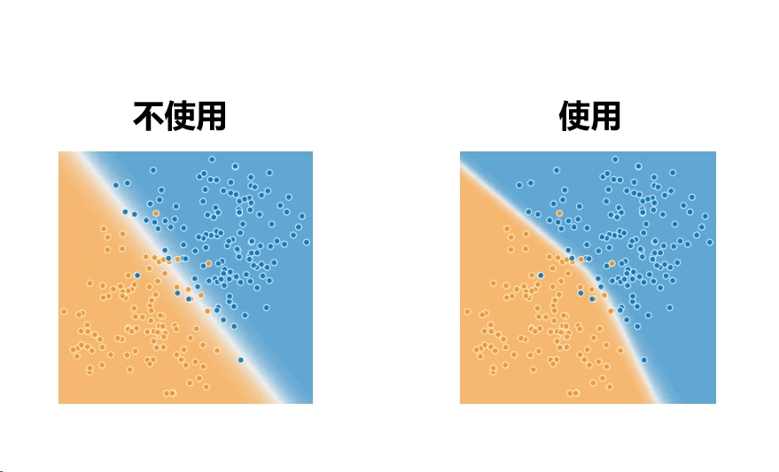

## 构建模型
构建神经网络需要先配置模型的层，然后再编译模型。 我们将构建一个快速开始序贯（Sequential）模型,序贯模型是多个网络层的线性堆叠，也就是“一条路走到黑”。
### 1.设置层
神经网络的基本构造块是层。层从馈送到其中的数据中提取表示结果。希望这些表示结果有助于解决手头问题。 这里我们将构建一个由三层神经网络组成的模型
```
model = keras.Sequential([
    keras.layers.Flatten(input_shape=(28, 28)),
    keras.layers.Dense(128, activation=tf.nn.relu),
    keras.layers.Dense(10, activation=tf.nn.softmax)
])
```


该网络中的第一层`tf.keras.layers.Flatten`将图像格式从二维数组（28x28 像素）转换成一维数组（28 * 28 = 784 像素）。可以将该层视为图像中像素未堆叠的行，并排列这些行。该层没有要学习的参数；它只改动数据的格式。(可以叫做展平层)


在扁平化像素之后，该网络包含两个`tf.keras.layers.Dense` 层的序列。这些层是密集连接或全连接神经层。第一个 Dense 层具有 128 个节点（或神经元）。relu 是激活函数，可以增加非线性输出
第二个（也是最后一个）层是具有 10 个节点的 softmax 层，该层会返回一个具有 10 个概率得分的数组，这些得分的总和为 1。每个节点包含一个得分，表示当前图像属于 10 个类别中某一个的概率。 
>Tips：什么是激活函数？
>
### 2.编译模型
在训练模型之前，我们需要通过compile来对学习过程进行编译。compile接收三个参数：

* 优化器optimizer：该参数可指定为已预定义的优化器名，如rmsprop、adagrad，或一个Optimizer类的对象，详情见optimizers
* 损失函数loss：该参数为模型试图最小化的目标函数，它可为预定义的损失函数名，如categorical_crossentropy、mse，也可以为一个损失函数。详情见losses
* 指标列表metrics：对分类问题，我们一般将该列表设置为metrics=['accuracy']。指标可以是一个预定义指标的名字,也可以是一个用户定制的函数.评估当前模型的性能
```
model.compile(optimizer=tf.train.AdamOptimizer(),
            loss='sparse_categorical_crossentropy',
            metrics=['accuracy'])
```